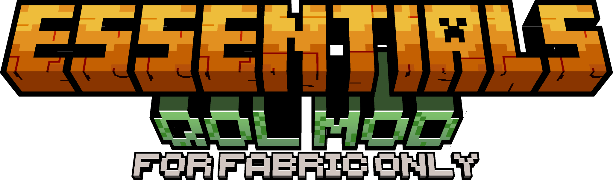

## Essentials QOL (Quality of Life) mod

Essentials QOL mod is a simple mod which adds a variety of helpful new commands and features to minecraft.

### Commands

- /trade <villagerEntity> <add|remove|update|restock> - Modify a villager's trade offers
- /fly <on|off> [targetPlayer] - Enable flight for player
- /heal [targetPlayer] - Heal player or heal a target player

### Features
- Tool Durability Notification - notifies you if your tool's durability reaches below the minimum threshold

### Dependencies
- [x] YetAnotherConfigLib (*required*)
- [ ] ModMenu (*optional*)

More features will be added as this is currently in development phase.